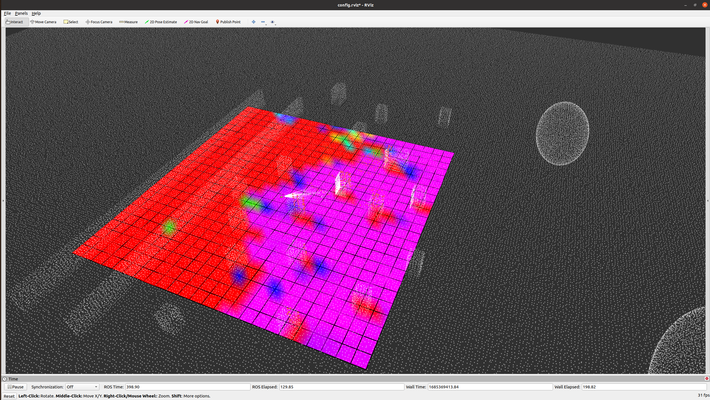
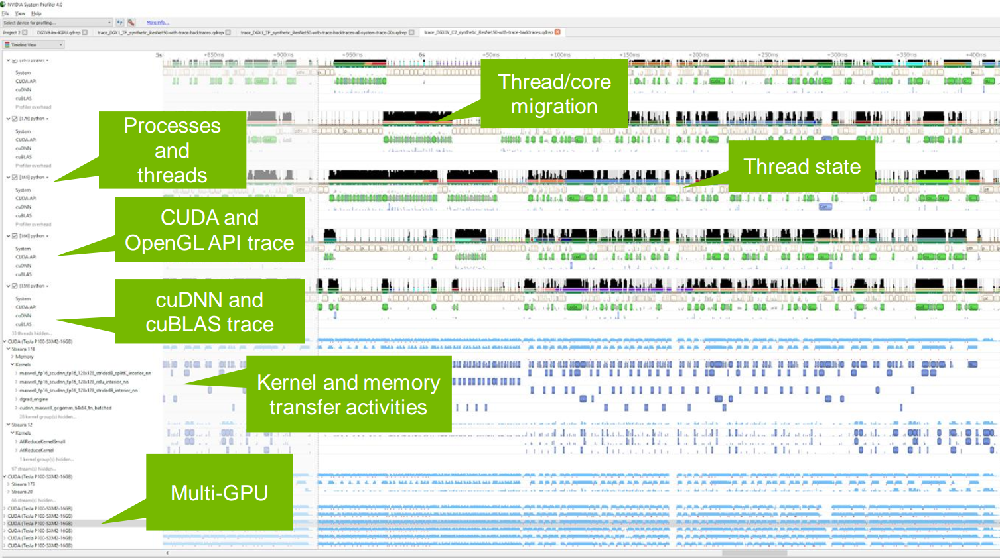

# LF-3PM    :construction: **_To be released_**
a LiDAR-based Framework for Perception-aware Planning with Perturbation-induced Metric

<!-- # LiDAR-based Perception Aware Planning -->
<div align="center">
  
</div>

## 1、Installation
ubuntu 20.04 and Noetic are recommended!
```
git clone https://github.com/cckaixin/perception_aware.git
```
### install gazebo plugins
```
sudo apt-get install ros-noetic-robot-state-publisher*
sudo apt-get install ros-noetic-joint-state-controller*
sudo apt-get install ros-noetic-controller*
sudo apt-get install ros-noetic-velocity-controllers*
sudo apt-get install ros-noetic-effort-controllers
sudo apt-get install ros-noetic-position-controllers
sudo apt-get install ros-noetic-gazebo-ros-control
sudo apt install ros-noetic-hector-gazebo
sudo apt-get install ros-noetic-effort-controllers
sudo apt-get install ros-noetic-joint-state-controller
sudo apt-get install ros-noetic-position-controllers
```
### install casadi ( C++ ) 
```
sudo apt-get install coinor-libipopt-dev
git clone https://github.com/casadi/casadi.git
cd casadi
mkdir build
cmake -DWITH_IPOPT=true ..
make -j4
sudo make install
```
## 2、Run

### launch gazebo simulation environment
```
roslaunch carsim spawn_car.launch
roslaunch carsim omni_car.launch
roslaunch carsim meca_car.launch
```

### key board control: wasd + j k
```
rosrun carsim keyboard_control_meca.py
```

### launch slam module
```
roslaunch fast_lio mapping_velodyne.launch 
roslaunch fast_lio mapping_avia.launch rviz:=true
```

### launch perception node
```
roslaunch perception_evaluator test.launch
```

### run plan manager
```
roslaunch manager test.launch
```

### trajectory tracker
```
rosrun mpc_controller mpc_controller_node
```

### evaluate slam error
```
rosrun perception_evaluator evaluate_location_error.py
```

### reset model location
```
rosservice call /gazebo/set_model_state "model_state:
  model_name: 'meca_car'
  pose:
    position:
      x: 0.0
      y: 0.0
      z: 0.0
    orientation:
      x: 0.0
      y: 0.0
      z: 0
      w: 1
  twist:
    linear:
      x: 0.0
      y: 0.0
      z: 0.0
    angular:
      x: 0.0
      y: 0.0
      z: 0.0
  reference_frame: 'world'"
```

## 3、Gpu adaptation
### **_CUDA NEEDED_ :**
Look up this [**website**](https://en.wikipedia.org/wiki/CUDA) for your 'GPU_version', and add it in **[src/PA_planner/perception_evaluator/CMakeLists.txt]**
```
SET(GPU_version 61) # 61 is for GTX 1060
```
### **_DEBUG with Nsight Systems_ :**
<div align="center">
  
</div>

Succinct commands are put as follows, if need more guidence, go to this [**repo**](https://github.com/Pupillen/Robotics_Coding/blob/master/Profiling.md)

**Dependence:**
```
git clone https://github.com/gperftools/gperftools
cd gperftools
./autogen.sh
./configure
make
sudo make install
```
**STEP0:** Configuring Compilation Options (CUDA & profiling)

CMakeLists.txt :
```
project(perception_evaluator CXX CUDA)

SET(CUDA_TOOLKIT_ROOT_DIR "/usr/local/cuda")
SET(ENABLE_CUDA true)
SET(CMAKE_CXX_STANDARD 14)
SET(CMAKE_EXPORT_COMPILE_COMMANDS ON)
SET(GPU_version 61)  # https://en.wikipedia.org/wiki/CUDA
SET(CUDA_SEPARABLE_COMPILATION ON)
SET(CUDA_NVCC_FLAGS ${CUDA_NVCC_FLAGS};-O3 -use_fast_math;)
SET(CUDA_NVCC_FLAGS -gencode arch=compute_${GPU_version},code=sm_${GPU_version};)
SET(CUDA_USE_STATIC_CUDA_RUNTIME OFF)

find_package(CUDA REQUIRED)
find_library(LIBNVTOOLSEXT nvToolsExt PATHS ${CMAKE_CUDA_IMPLICIT_LINK_DIRECTORIES})

include_directories(
  ${CUDA_INCLUDE_DIRS}
)

add_library(LDF_accelerator src/LDF_accelerator.cu)

target_link_libraries(LDF_accelerator 
  ${CUDA_LIBRARIES}
  profiler
  ${LIBNVTOOLSEXT}
)
```
xxx.cu :
```
// Set Flags as our own nsys detector
nvtxRangePush("gpuInit");
gpuInit();
nvtxRangePop();
```
```
// Stop compiler optimization for accurate log (optional)
volatile bool tmp = false;
if (tmp) ProfilerStop();

// Add these two sentences of code to each function that needs to be analyzed
// and place them at the end of the logical code for the function. In this way, 
// when a function that needs to be analyzed is completed, these two lines of 
// code will be executed, and the ProfilerStop() function will be called to stop
// the performance analyzer, ensuring the accuracy of the analysis results
```

**STEP1:** Compile and generate executable files for subsequent analysis
```
catkin_make
```
**STEP2:** use nsys-tool to generate the profile for nsight-sys visualization
```
nsys profile -t nvtx,cuda --stats=true -f true -o gpu_profile devel/lib/perception_evaluator/perception_node_gpu nsight-sys
```
**STEP3:** use nsight-sys to visualize profiles of your target code
```
nsight-sys
```
check your CPU and GPU status by:
```
htop
nvidia-smi -l 1
```
